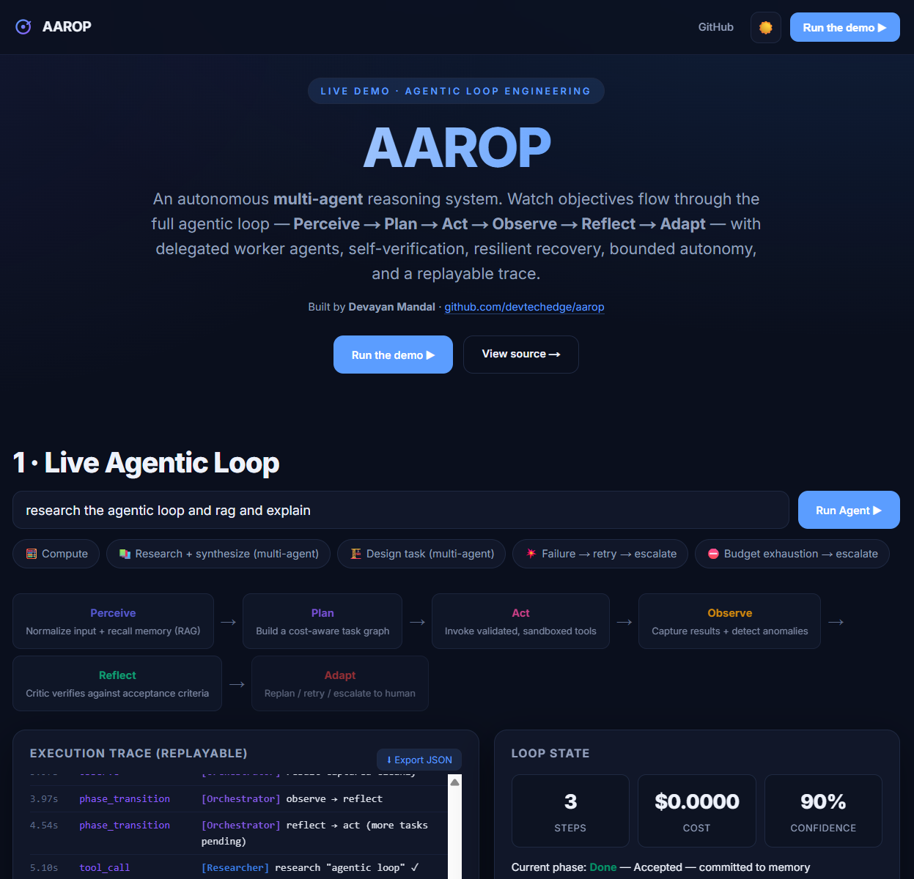
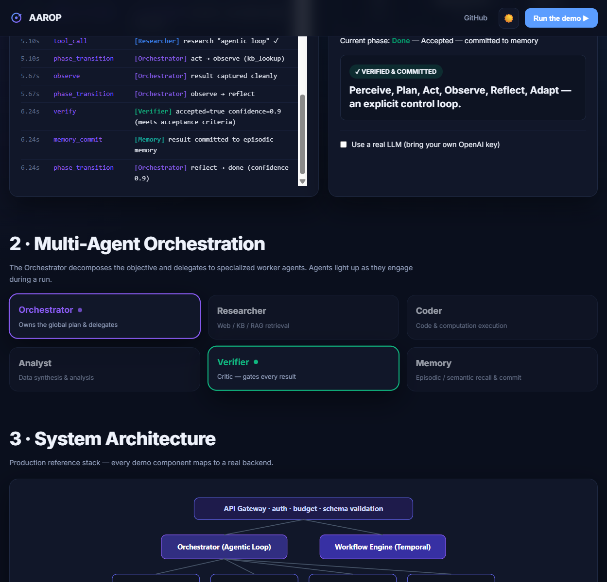
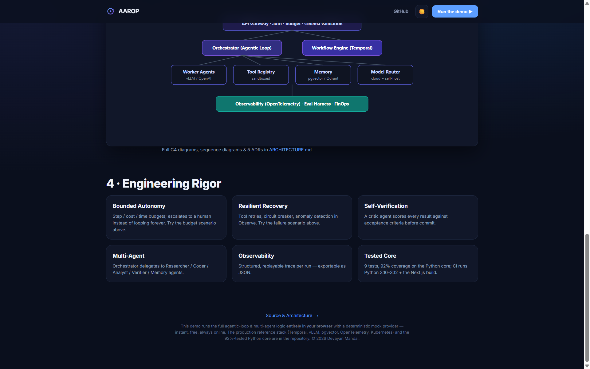

# 🧠 AAROP - Autonomous Agentic Reasoning & Orchestration Platform

> A reference implementation of a **multi-agent AI system built on agentic-loop engineering principles**: `Perceive → Plan → Act → Observe → Reflect → Adapt`. The loop is an **explicit, inspectable state machine** - not a hidden prompt chain - with bounded autonomy, self-verification, durable checkpointing, and full trace replay.

<p align="left">
  <a href="https://aarop.vercel.app/"></a>
  <a href="https://github.com/devtechedge/aarop/actions"></a>
  
  
  
  
  <a href="LICENSE"></a>
</p>

### 🌐 [**▶ Try the Live Demo →**](https://aarop.vercel.app/)
Watch an objective flow through the full agentic loop in real time - no install, no API keys, no sign-up.

> **Live demo status:** 100% client-side TypeScript port with a deterministic mock provider - always online on Vercel. The Python `core/` engine runs offline with the same loop semantics (24 tests, 99% coverage).

**Built by [Devayan Mandal](https://github.com/devtechedge)** - AI / ML Engineer.

---

## Screenshots

| Live agentic loop | Multi-agent orchestration |
|-------------------|---------------------------|
|  |  |

| System architecture + engineering rigor |
|-----------------------------------------|
|  |

---

## What's in this repository

| Path | What it is | Role |
|---|---|---|
| **[`core/`](core/)** | The Python reference engine - the agentic loop, agents, tool registry, memory, model router, observability. **24 tests, 99% coverage. Runs offline, no API keys.** | **Canonical** |
| **[`web-demo/`](web-demo/)** | A **Next.js live demo** ([aarop.vercel.app](https://aarop.vercel.app/)) that animates the full agentic loop in the browser. | Derived port |
| **[`docs/AAROP_Case_Study.pdf`](docs/AAROP_Case_Study.pdf)** | A polished 4-page case study (problem → architecture → results → ADRs). | |
| **[`core/docs/ARCHITECTURE.md`](core/docs/ARCHITECTURE.md)** | C4 diagrams, production reference stack, and 5 ADRs. | |
| **[`core/docs/PROJECT_SPEC.md`](core/docs/PROJECT_SPEC.md)** | The full chief-architect-level system specification. | |

## Two implementations: which one is canonical?

**`core/` (Python) is the canonical engine.** It is the reference implementation, and it is where
the tests, the coverage figure, the ADRs and the production specification live. Every change to
loop phases, budget guardrails or tool contracts lands in Python first.

**`web-demo/lib/aarop.ts` is a derived browser port.** It exists so the loop can be watched in a
tab with no install and no API key. It reproduces the canonical phase semantics, then adds
demo-only affordances the Python engine deliberately does not carry:

- chained multi-step plans
- multi-agent delegation metadata (which worker owns each task)
- a failure-injection path that demonstrates retry, circuit-breaker and escalate
- an optional bring-your-own-key hook for a single generation step

Those extras are presentation, not engine features, and they are not back-ported to Python. So the
two files are intentionally not line-for-line identical: **treat any divergence in loop semantics
as a bug in the TypeScript file, not in the Python one.**

## The Agentic Loop

```
PERCEIVE → PLAN → ACT → OBSERVE → REFLECT ──accept──► DONE
   ▲                                  │
   └──────────── ADAPT ◄──────reject──┘   (budget exhausted → ESCALATE)
```

| Phase | Responsibility |
|---|---|
| **Perceive** | Normalize input + retrieve relevant context / memory (RAG) |
| **Plan** | Build a cost-aware hierarchical task graph |
| **Act** | Invoke schema-validated, sandboxed tools / sub-agents |
| **Observe** | Capture structured results + detect anomalies |
| **Reflect** | Critic verifies output against acceptance criteria |
| **Adapt** | Replan / retry with backoff / escalate to a human |

Every phase transition emits a structured trace event, so any run is fully reconstructable and replayable. Every run respects step / cost / time budgets and escalates instead of looping forever.

## Repository layout

```
aarop/
├── core/                       # Python reference engine (runs offline, 99% tested)
│   ├── src/aarop/
│   │   ├── core/loop.py        # agentic loop state machine + Budget guardrails
│   │   ├── agents/agents.py    # Planner · Actor · Verifier (critic)
│   │   ├── tools/registry.py   # schema-validated tools, scopes, circuit breaker
│   │   ├── memory/store.py     # working / episodic / semantic memory + RAG
│   │   ├── routing/            # cost-aware model router
│   │   └── observability/      # structured tracing + replay
│   ├── examples/run_demo.py
│   ├── tests/test_loop.py
│   └── docs/                   # ARCHITECTURE.md, PROJECT_SPEC.md
├── web-demo/                   # Next.js 14 live demo (Vercel) - derived port
│   ├── app/
│   ├── lib/aarop.ts            # TS port of the loop + demo-only extras + node:test helpers
│   ├── e2e/                    # Playwright Chromium smokes
│   └── public/favicon.svg
├── docs/
│   ├── AAROP_Case_Study.pdf
│   └── screenshots/
├── SECURITY.md
├── LICENSE
└── README.md
```

## Quickstart

**Core engine (Python):**
```bash
cd core
pip install -e ".[dev]"
python examples/run_demo.py --objective "calculate 21*2 + 8" --verbose
pytest --cov=aarop          # 24 passed · 99% coverage
```

**Live demo (Next.js):**
```bash
cd web-demo
npm ci
npm test                    # node:test helpers (calculator, planner, loop)
npm run typecheck
npm run dev                 # http://localhost:3000
```

## Architecture & engineering rigor

- **Explicit loop state machine** - observable, replayable, crash-recoverable
- **Bounded autonomy** - step / cost / time budgets with human escalation
- **Self-verification** - a critic agent gates every result before commit
- **Resilient tooling** - schema-validated, permission-scoped, retries + circuit breaker + audit log
- **Cost-aware model routing** - cloud + self-hosted, pluggable
- **Observability** - structured trace per run (OpenTelemetry-shaped)
- **99% test coverage** on core orchestration; CI across Python 3.10–3.12, plus web unit tests, `tsc --noEmit`, and Playwright smokes

See **[`core/docs/ARCHITECTURE.md`](core/docs/ARCHITECTURE.md)** for C4 diagrams, the production reference stack (Temporal, FastAPI, pgvector, vLLM, Kubernetes, OpenTelemetry), and **5 Architecture Decision Records**.

## Live demo

The [`web-demo/`](web-demo/) carries the loop over to TypeScript and runs **100% client-side** with a deterministic mock provider - instant, free, and always online. It follows the canonical Python semantics and adds demo-only extras on top; see the section above for what that means. Deployed on Vercel: **[aarop.vercel.app](https://aarop.vercel.app/)**. See [`web-demo/README.md`](web-demo/README.md) for deploy steps.

Threat model for both surfaces: **[`SECURITY.md`](SECURITY.md)**.

## Roadmap

- [ ] Pluggable real LLM provider (OpenAI / Anthropic / self-hosted vLLM)
- [ ] Persistent memory backend (pgvector / Qdrant) + cross-encoder reranker
- [ ] Durable workflow execution via Temporal
- [ ] OpenTelemetry exporter + Grafana dashboards
- [ ] "Bring your own API key" toggle in the live demo

## Contributing

See [`CONTRIBUTING.md`](CONTRIBUTING.md). Issues and PRs welcome.

## License

MIT © 2026 Devayan Mandal - see [`LICENSE`](LICENSE).
